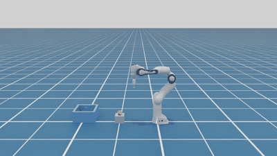
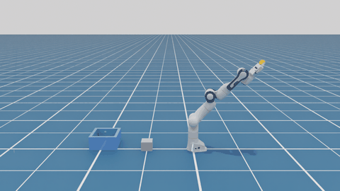

# Franka Panda: Throwing a Ball into a Basket (Isaac Sim 6.1)

SLED Lab take-home, **Task 3: throw a ball into a basket**.

A Franka Panda picks a ball up from a pedestal, winds up, and swings its arm like a whip. While it swings, it predicts every physics step where the ball would land if it let go at that moment. It opens the gripper on the step whose predicted landing point is closest to the basket, and brakes the arm at the same time.

**Result: 10 / 10 successful throws** over randomized basket positions (x ∈ [0.75, 1.10] m, y ∈ [−0.25, 0.25] m). The worst trial crossed the rim plane 9.4 cm from the basket center. That is just outside the ±9 cm the ball needs to clear the rim without touching it, so that ball must have grazed the rim before dropping in.

| Full attempt (real time) | Release (¼ speed) |
|---|---|
|  |  |

Full demo video, three randomized trials in real time: [`media/throw_demo.mp4`](media/throw_demo.mp4).

---

## 1. Setup

| | |
|---|---|
| Simulator | Isaac Sim 6.1, **PhysX** (checked with `SimulationManager.get_active_physics_engine()`), dt = 1/60 s |
| Robot | Franka Panda (`Isaac/Robots_Multiphysics/FrankaRobotics/FrankaPanda/franka/franka.usda`), default joint drives |
| Ball | Sphere, radius 3 cm, mass 60 g, starts on a 10 cm pedestal at (0.5, 0) |
| Basket | Static box: inner size 24 × 24 cm, walls 15 cm tall and 3 cm thick. Walls are thick because the ball travels about 7 cm per step and would tunnel through thin walls |
| State | The ball's position and velocity are read directly from simulation. No perception |
| API | `isaacsim.core.experimental.*` only. The 6.1-deprecated `isaacsim.core.api` and `isaacsim.robot.manipulators` are not used |

Joint indices below are 0-based as in code: `q[0]` is `panda_joint1`, and `q[7]`, `q[8]` are the fingers.

## 2. Method

The throw is a state machine (`scripts/07_trials.py`):

```
pick (IK) ─► wind-up (joint interpolation) ─► swing (joint targets) ─► closed-loop release + brake ─► settle & judge
```

### 2.1 Pick: differential IK to the grasp frame
- Damped least squares: `Δq = Jᵀ(JJᵀ + λ²I)⁻¹ e` with λ = 0.05, applied once per step on the 6-D pose error of `panda_hand` (`scripts/franka_utils.py`).
- The target is the **finger-center grasp frame**, 0.1034 m in front of `panda_hand` (the offset NVIDIA's Franka config uses). The IK target is converted from this frame to the hand frame, with the gripper pointing down.
- Phases: approach → descend → close → lift, each ending on an error tolerance or a timeout (`scripts/03_gripper.py`).
- Measured: reaching to within 1 cm takes 0.6–1.2 s. There is a 0.2–0.5 cm steady-state error from gravity, because a position target of `q + Δq` behaves like a P-controller. This is far too slow to use IK during the swing.

### 2.2 Swing: a "whip" in joint space
Single-joint swings (`scripts/04_swing.py`) gave peak hand speeds of **1.57** m/s for the shoulder `q[1]`, **1.06** for the elbow `q[3]`, and **0.60** for the wrist `q[5]`. The first combined attempt, with all three joint angles increasing, reached only **1.14 m/s** because the contributions cancelled out.

Fitting the speed directions from those runs, and checking the result against the READY pose, gives these pitch angles for each link in the vertical plane (measured from vertical, positive = leaning forward):

```
upper arm  θ1 = q[1]
forearm    θ2 = q[1] − q[3]
hand       θ3 = q[1] − q[3] − q[5] + π
```

So the elbow and the wrist have to **decrease** while the shoulder **increases** for every link to rotate forward. The wind-up keeps the arm straight (θ1 = θ2 = θ3 = −45°), giving `[0, −0.785, 0, −0.07, 0, π]`. The swing then sets joint targets `q[1] → 1.0`, `q[3] → −1.8`, `q[5] → 1.4` at once, so every joint accelerates at its drive limit. The hand velocity is perpendicular to the arm, so leaning the arm back 45° gives a forward-and-upward throw.

The peak hand speed is **3.46 m/s**; the rough theoretical limit is ≈ 3.7. The shoulder carries the whole outstretched arm and reaches full speed only after about 0.45 s, when it hits its effort limit. This trades release speed against release angle: 2.4 m/s at 41°, or 2.8 m/s at 30°.

`q[0]` is set to the basket's azimuth `atan2(y, x)` so that the whole throwing plane points at the basket.

### 2.3 Closed-loop release
Every physics step during the swing, the controller uses the ball's current position `p` and velocity `v` (the ball is still in the hand) to solve for the **descending** crossing of the rim plane `z = 0.15 m`:

```
z0 + (vz − ½ g dt) t − ½ g t² = z_rim   →   take the larger root, then substitute t into x(t), y(t)
```

The extra `½ g dt` term models PhysX's semi-implicit Euler integration. Without it, the continuous-time formula drifts from simulation by ½·g·dt·t, about 8 cm per second of flight. With it, prediction matches simulation to **0.00 cm** (`scripts/01_trajectory.py`).

The predicted landing distance along the aim direction moves forward by about 10–12 cm per physics step. So the controller releases on the step closest to the target: `d + (d − d_prev)/2 ≥ target`. This rounds to the nearest step instead of always overshooting.

### 2.4 Release and brake
How cleanly the gripper releases turned out to dominate accuracy (`scripts/05_throw.py`):

| Gripper roll `q[6]` | Brake at release | Steps from command to ball leaving the hand | Result |
|---|---|---|---|
| 2.356 (fingers in the swing plane) | no | **18–19** | The trailing finger keeps pushing the ball, which leaves pointing −27° to −34° (downward) |
| 0.785 (fingers across the swing plane) | no | 4–6 | The still-accelerating wrist catches the ball about 0.3 s after release. Prediction error from the true release state jumps from 0 to 22 cm |
| **0.785** | **yes** | **2** | No arm contact. Predicting from the state at the **command** step lands within **3.1 cm** |

The brake sets all 7 arm joint targets to their current positions at the release step. The hand then decelerates and the ball moves ahead of it, out through the open side between the fingers.

## 3. Evaluation

`run.bat scripts\07_trials.py --trials 10 --headless` (seed 0) writes `outputs/trials.csv`. The deviation columns are measured where the ball crosses the rim plane, relative to the basket center.

| # | basket x | basket y | yaw ° | release t (s) | speed (m/s) | elevation ° | along (cm) | across (cm) | result |
|---|---|---|---|---|---|---|---|---|---|
| 1 | 0.973 | −0.115 | −6.7 | 0.17 | 2.76 | 26.4 | +7.4 | −2.9 | ✅ in |
| 2 | 0.764 | −0.242 | −17.6 | 0.13 | 2.57 | 33.6 | +0.5 | −2.7 | ✅ in |
| 3 | 1.035 | +0.206 | +11.3 | 0.17 | 2.77 | 26.6 | +0.1 | −3.0 | ✅ in |
| 4 | 0.962 | +0.115 | +6.8 | 0.17 | 2.76 | 26.1 | +9.4 | −1.4 | ✅ in |
| 5 | 0.940 | +0.218 | +13.0 | 0.15 | 2.67 | 30.3 | −4.9 | −2.7 | ✅ in |
| 6 | 1.036 | −0.249 | −13.5 | 0.17 | 2.77 | 26.1 | +0.3 | −0.9 | ✅ in |
| 7 | 1.050 | −0.233 | −12.5 | 0.17 | 2.76 | 26.1 | −1.4 | −2.2 | ✅ in |
| 8 | 1.005 | −0.162 | −9.2 | 0.17 | 2.77 | 26.1 | +4.9 | −1.1 | ✅ in |
| 9 | 1.052 | +0.021 | +1.1 | 0.17 | 2.76 | 26.7 | −0.3 | −2.6 | ✅ in |
| 10 | 0.855 | −0.039 | −2.6 | 0.15 | 2.67 | 30.1 | +6.5 | −2.4 | ✅ in |

**Success: 10/10.** Along-aim deviation: +2.3 ± 4.3 cm. Across-aim deviation: −2.2 ± 0.8 cm. The simulation is deterministic, so re-running with the same seed reproduces these numbers exactly.

## 4. Failure analysis and error budget

No trial failed, but the margin is thin. To clear the rim without touching it, the ball's center must cross within ±9 cm of the basket center (half of the 24 cm opening, minus the 3 cm radius). The worst trial was at 9.4 cm. Splitting each deviation into *predicted landing − target* and *actual − predicted* gives:

| Error source | Size | Type | Evidence | Fix |
|---|---|---|---|---|
| **Release timing quantization**: release happens only on whole physics steps, and the landing point moves about 10–12 cm per step | −0.3 ± 4.1 cm (along) | Quasi-random, the largest term | Only 3 distinct release times (0.13 / 0.15 / 0.17 s) across baskets from 0.76 to 1.05 m | dt = 1/120 halves it. Or adjust the swing speed so that a step boundary falls on the target |
| **Release disturbance**: fingers drag the ball during the 2-step release | +2.6 ± 1.1 cm (along) | Systematic | actual − predicted is always positive | Subtract 2.6 cm from the target distance |
| **Lateral bias**: the ball has a sideways velocity of 0 to −0.09 m/s while held | −2.2 ± 0.8 cm (across) | Systematic, always the same side in all 10 trials | Logged `q[0]`, `q[2]`, `q[4]` stay within 0.01 rad during the swing, so the arm does not leave the plane; the velocity comes from the ball moving between the fingers. Suspected cause: asymmetric finger contact (not confirmed) | Aim about 2 cm to the opposite side |

The first two terms add linearly, so a basket much smaller than about 20 cm, or much farther away (longer flight), would start to fail.

**Failure modes found and fixed during development.** Each one broke the throw completely before it was fixed.
1. **Grip lost during the wind-up.** Interpolating the finger targets starting from their *measured* positions made target equal actual, so the grip force (proportional to target − actual) dropped to zero and the ball fell out. Fix: interpolate the 7 arm joints only, and keep the finger target closed.
2. **Joint-sign cancellation in the swing**: 1.14 m/s instead of 3.46 m/s. See §2.2.
3. **Trailing finger carries the ball**: 18-step release delay and a downward throw. See §2.4.
4. **Arm catches the released ball**: 22 cm deviation. Fixed by braking. See §2.4.

**Limitations.** The ball state is read from simulation (no vision) and there is no sensor or actuation noise, so the 10/10 comes from a noiseless, deterministic simulation. The pick location is fixed. Basket positions were tested only within the range above, where release happens between 0.13 and 0.17 s. Farther baskets need later releases at flatter angles, and the maximum reachable distance was not measured. The ball is only 3 cm smaller than the 8 cm maximum gripper opening. The sample size (10) is small.

**Next steps.** Inject noise (ball pose, basket pose, joint-drive gains) and run hundreds of trials; apply the two bias corrections; use dt = 1/120; start the shoulder before the elbow and wrist (proximal-to-distal timing) to raise speed at higher release angles and extend the range.

## 5. How to run

Requires Isaac Sim 6.1 installed at `D:\isaacsim` (see `docs/SETUP_zh.md`). Always use Isaac Sim's bundled Python through `run.bat` (it calls `D:\isaacsim\python.bat`). Add `--headless` to run without a window.

```bat
run.bat scripts\07_trials.py --trials 10 --headless        :: randomized evaluation → outputs\trials.csv
run.bat scripts\07_trials.py --trials 3                    :: watch it in the GUI
run.bat scripts\06_basket.py --basket-x 1.0                :: single throw, prints the per-step landing prediction
run.bat scripts\07_trials.py --trials 3 --headless --record :: save frames → outputs\frames\
D:\anaconda\python.exe tools\make_video.py --name throw_demo   :: frames → MP4 / GIF (needs Pillow + imageio-ffmpeg)
```

The recorder captures one frame every 2 physics steps (`scripts/recorder.py`), so videos play at true simulation speed however fast the machine renders.

## 6. Repository layout

The scripts are numbered in the order they were built. Each one is a self-contained experiment toward the final throw.

| File | Purpose |
|---|---|
| `scripts/00_hello_franka.py` | Smoke test: scene, Franka, ball |
| `scripts/01_trajectory.py` | Ballistic prediction versus PhysX; semi-implicit Euler correction |
| `scripts/02_ik_reach.py` | Differential IK to the grasp frame and reach timing; P- versus I-style target update |
| `scripts/03_gripper.py` | Pick → lift → place state machine and success check |
| `scripts/04_swing.py` | Swing-speed experiments that lead to the whip poses |
| `scripts/05_throw.py` | Hold-while-swinging (`--q6`) and timed release (`--release-t`) experiments |
| `scripts/06_basket.py` | Basket and closed-loop release, single throw |
| `scripts/07_trials.py` | **Final:** randomized trials, yaw aiming, failure classes, CSV, recording |
| `scripts/franka_utils.py` | Shared code: scene, `FrankaArm` (IK, gripper), ballistics (`predict_position`, `crossing_point`) |
| `scripts/recorder.py` | Frame capture through a Replicator RGB annotator; dependency-free PNG writer |
| `tools/make_video.py` | PNG frames → MP4 / GIF |
| `docs/ROADMAP.md` | Development log with every experiment's numbers (Chinese) |
| `docs/SETUP_zh.md` | Environment setup notes (Chinese) |

Code comments and console output are in Chinese; they were written as learning notes while building the project.
